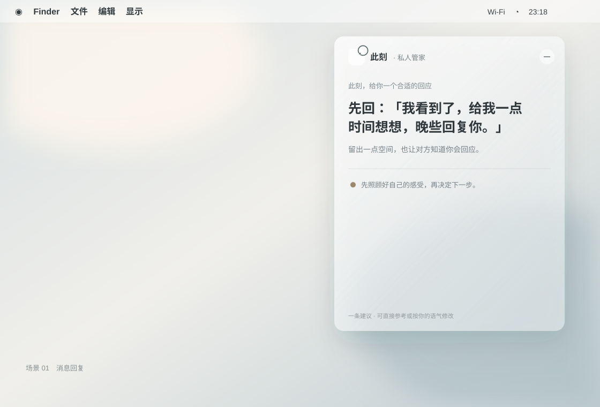
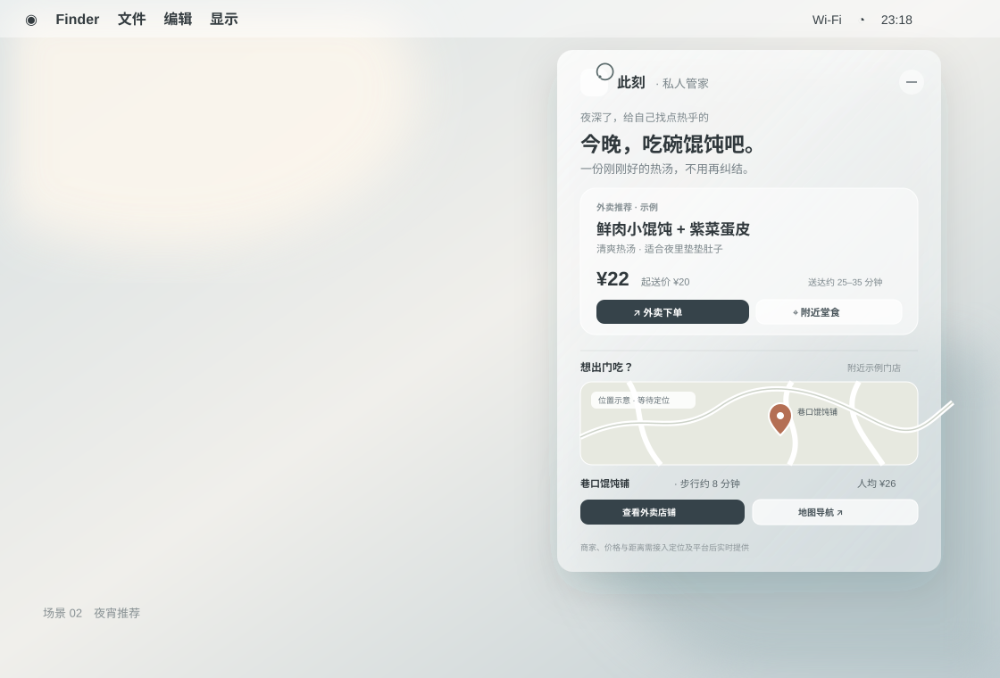
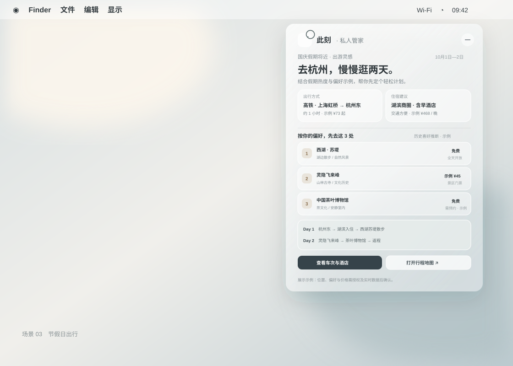

# 此刻｜私人管家产品概要

## 1. 是什么？一个私人管家

**此刻**是一款常驻 macOS 顶部菜单栏的轻量私人管家。当用户在选择、回复或规划上感到犹豫时，点开它即可获得一个简洁、具体、能马上采取行动的建议。

它的核心体验是：**理解当下，只给一个建议。** 不堆选项，不要求用户先写一段复杂的提示，也不把犹豫变成更多待办。

### 品牌与呈现

- **名称：** 此刻
- **Logo：** 单色开口圆弧，焦点落在圆弧缺口处。菜单栏中以白色圆环与圆点展示，确保在深色菜单栏清晰可见。
- **载体：** macOS 菜单栏小插件，点开后呈现紧凑、随内容高度收缩的弹层。
- **视觉：** 半透明毛玻璃底色、macOS 系统字体、克制的中性色与柔和阴影。内容面板和外层窗口均使用 18 pt 连续圆角；承载窗口图层保持透明，不保留内容之外的半透明底。
- **答案形式：** 一句明确建议作为视觉焦点；需要执行时附一个对应入口或简短计划。地图、价格、交通、住宿等信息以卡片形式补充。
- **交互原则：** 打开即看到当前最相关的一条建议；不需要「生成答案」按钮或多层分类导航。用户应能轻易忽略、关闭或纠正建议。

## 2. 为什么？预期解决什么问题？

人们会在日常小事上消耗大量精力：不知道怎么回消息、在外卖里挑不出吃什么、临近假期却迟迟定不下交通和住宿。此刻希望替用户减少选择负担，帮助其从「反复权衡」走到「有一个合适的下一步」。

### 预期价值

- **降低决策疲劳：** 给出一个经过情境整理的首选，不再把选择题丢回给用户。
- **让建议及时出现：** 用户主动点开时，结合时间、日历、位置或近期活动等可用信号，推测当下可能需要的支持。
- **让建议能落地：** 在合适的场景中直接提供可执行的回复文本、外卖入口、地图、车次或住宿信息。
- **支持而不施压：** 语气友善、尊重用户选择，不诱导冲动消费，不做羞辱、恐吓或强化焦虑的表达；不确定时说明不确定，并优先提供低风险、可撤回的下一步。

## 3. 怎么做？交互形式与实际场景

### 共通交互流程

1. 用户点击菜单栏中的「此刻」图标。
2. 系统根据当前时间、用户授权提供的情境信号和近期意图，判断最相关的需求类型。
3. 弹层直接展示**一个**首选建议，并给出简短理由。
4. 若建议涉及外部服务，提供清晰的下一步入口，例如打开外卖平台、地图或预订页面。
5. 用户可以执行、忽略、关闭或纠正。之后的推荐应吸收这些反馈。

**当前菜单栏原型的触发规则：** 午餐 11:30–13:29、下午茶 15:00–15:59、晚餐 16:30–19:29、夜宵 22:00–00:59 分别展示各自的单一餐食建议。内容推荐、休息提醒与节假日出行建议按现有规则出现。当前版本不读取微信对话，也不展示回复建议。

判断不确定时，不应把猜测伪装成确定结论。可以使用温和、可跳过的表达，或先给低风险建议；不要同时罗列一堆选项。

### Case 1：不知道如何回复消息（暂缓实现）

**情境：** 用户在聊天中面对邀请、请求或敏感话题，担心措辞不合适或不知道如何表达边界。

**呈现：** 直接给一条可以复制或参考的回复，再附一句简短说明。例如：「我看到了，给我一点时间想想，晚些回复你。」说明它既表达了回应，也给用户留出空间。

**当前状态：** 这是保留的设计案例；微信对话读取、聚焦检测和回复建议已从当前 App 移除。

### Case 2：午餐、晚餐或夜宵选择

**情境：** 用户在午餐（11:30–13:29）、晚餐（16:30–19:29）或夜宵（22:00–00:59）时段打开插件，没有明确输入时，系统推测其正在考虑吃什么。用餐时段分开呈现不同的一道推荐，并优先于节日出游情境。

**呈现：** 只推荐一个具体订单：午餐示例为「照烧鸡腿饭 + 时蔬」，晚餐为「番茄牛腩饭」，夜宵为「鲜肉小馄饨 + 紫菜蛋皮」。卡片展示示例价格、预计配送时间及美团外卖落地页入口；也可以在同一建议下给出附近堂食位置、人均价格和地图导航入口，让用户按需要选择是否外出。

**需要的数据：** 用户所在位置（需授权）、当前营业商家、菜单与价格、配送范围和预计送达时间。当前原型外卖入口打开美团公开首页，餐食和价格为示例；接入实时平台数据后，结果应标明价格/营业状态的更新时间。没有可靠实时数据时，不展示虚构的距离、商家或价格。

### Case 3：节假日出行计划

**情境：** 临近国庆等假期，用户打开插件但没有明确表达意图。结合假期时间、可用日历和获授权的历史偏好，推测用户可能在考虑出行。

**呈现：** 给出一份单一、简洁的计划清单，至少包括：

- **出行方式：** 例如出发地到目的地的高铁/航班建议、预计时长和实时价格入口。
- **住宿：** 推荐的区域或酒店、每晚价格、交通便利性和预订入口。
- **偏好景点 Top：** 根据用户明确授权的历史偏好排序，附景点简述、门票价格/免费信息和预约要求。
- **行程与地图：** 按天安排的简短路线、地图标记与导航入口，以及营业时间、拥挤程度或预约等注意事项。

**需要的数据：** 用户出发地、出行日期、日历可用时间、偏好反馈、车次/航班、住宿、景点票务和地图服务。价格、营业状态、预约要求必须来自实时或可信来源，并注明更新时间或以服务商页面为准。

> 上述三个 UI case 中展示过的城市、商家、价格、路线和偏好均为原型示例，不代表实时数据或对真实用户历史的读取。

## 底层需要用到的技术

### 1. 情境与意图推断

- **情境信号：** 本地时间、日期/节假日、用户授权的位置、日历空档、用户主动分享的文本，以及明确连接的应用数据。
- **意图识别：** 轻量分类模型或 LLM 对当前需求分类（消息回复、餐食选择、出行规划等），并估计置信度。
- **主动出现的边界：** 当前产品体验是用户主动点开后生成建议。后台持续监控应作为单独、明确授权的能力设计；提供逐项开关、可见状态、暂停/删除数据能力，不默认读取其他 App 内容。

### 2. 推荐系统（recommend）

- 先由规则与上下文过滤不可行项（营业时间、预算、距离、日期、交通/预约条件）。
- 再按用户明确表达的偏好、历史交互和当前情境对候选进行排序，最终选择一个首选。
- 记录用户对建议的执行、忽略、改选或纠正，用于更新偏好；允许查看、修改和重置画像。
- 提供安全与质量约束：避免有害心理健康建议、危险路线、过时价格和不实承诺；置信度不足时降低个性化程度。

### 3. LLM 与工具调用

- **LLM：** 归纳上下文、生成自然简洁的建议文案、说明选择理由，并按固定结构输出（建议、理由、价格/时间、行动入口、注意事项）。
- **检索与 API：** 外卖平台、地图/导航、交通票务、住宿预订、景点票务与节假日信息通过官方 API、合作接口或明确授权的数据连接器获取。
- **事实校验：** LLM 不应凭空生成价格、营业状态、距离、车次或酒店信息；这些字段由外部数据源提供，并附来源与更新时间。
- **执行边界：** 默认只生成建议并跳转到服务页面。下单、付款、预订、发送消息等有实际后果的操作，应由用户在目标 App 中确认。

### 4. 跨 App 数据与隐私

- 采用**用户主动连接、按需授权、最小化采集**的方式打通应用数据，不假设 macOS 可以无条件读取所有 App 内容。
- 明确区分本地数据、云端数据、第三方服务数据；说明采集目的、保留时间与删除方式。
- 消息、位置、日历和行为历史属于敏感数据；优先本地处理或短期处理，传输与存储加密，未经授权不用于模型训练或广告画像。
- 提供随时撤销授权、清空历史、关闭个性化和关闭情境推断的入口。

### 5. macOS 客户端

- 菜单栏常驻状态项与轻量弹层；可用 SwiftUI/AppKit 实现原生 macOS 体验。
- 系统权限通过标准授权流程请求；根据所连接服务能力选择官方 API、分享扩展、快捷指令或用户主动选中文本等方式集成。
- 通知或主动提示需单独征得用户同意，并可配置安静时段、触发频率与总开关。
