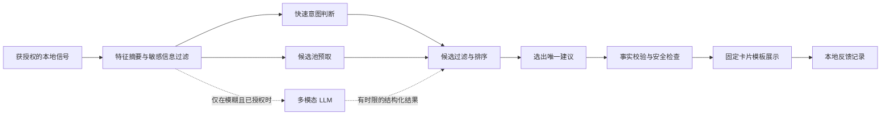

# 「此刻」体验优化技术方案

> 基于 2026-10-08 的菜单栏原型代码。本文是下一阶段的设计方案；文中的延时与效果指标是**目标值**，不是现有产品的实测结果。2026-10-09 起，微信对话读取与回复建议已从当前 App 移除，文中相关内容仅作未来方案参考。

## 一、要解决的问题

「此刻」的核心任务不是猜中一个固定场景，而是判断：**用户为什么在这一刻点开它，并从可执行的候选中只给出一条最合适的建议。**

### 当前实现与体验缺口

| 现状 | 用户感受到的问题 | 代码中的原因 |
| --- | --- | --- |
| 内容推荐按站点顺序轮换，并取该站点第一篇未展示文章 | 主题、阅读时间和当下兴趣不匹配，感受接近随机 | `SspaiTopOneStore.loadNext()` 使用来源游标与已展示 URL，没有用户兴趣或当下意图评分 |
| 午餐、下午茶、晚餐、夜宵在固定时段优先出现，每餐期每日最多两次 | 已吃过饭仍会被推荐；真正想点餐时又可能因为次数耗尽而看不到 | `AdviceScene.meal` 的时间窗与 `canPresent` 的硬上限 |
| 节日旅行只在内容耗尽时出现 | 旅行意图也可能出现在非节假日 | `showTravelWhenHolidayContentIsExhausted` 的兜底规则 |
| 点击后才可能拉取文章列表、文章页、翻译和首图 | 先看到占位内容，再等标题或封面变化 | 内容源轮询、逐源请求、文章详情抓取、翻译和图片加载分阶段发生 |
| 原文无图时调用文本模型和生图模型 | 这条链路可能明显慢于弹窗打开 | 生图包含提示词生成、图片生成和下载；不适合放进点击后的首屏路径 |
| 本机仅保存少量展示计数与已展示链接 | 不知道点击原文、忽略建议等行为是否代表偏好 | 尚无成体系的本地反馈事件、候选特征与意图评估 |

这里的“随机”指**对用户意图而言近似随机**：当前代码实际采用来源轮换，并非随机数抽取。

## 二、目标体验

1. 用户点开后，先看到**一张完整、稳定的卡片**；不在几秒内反复改写推荐类型。
2. 系统用时间、前台应用、焦点、授权数据和自身历史反馈推断本次意图；时间与节假日只增加相关性，不直接决定答案。
3. 即使没有模型、网络或第三方权限，也能从本地缓存选出一条可解释的建议。
4. 每条建议保留“只给一个方向”的产品原则；链接、价格、商家、车次与酒店等事实必须有可信来源。
5. 敏感上下文默认在本机处理。只有用户单独同意云端分析时，才发送经裁剪的必要信息。

建议设定以下首批**验收目标**，再用真实设备数据调整：

| 指标 | 目标 | 说明 |
| --- | --- | --- |
| 弹窗首个有意义内容的 P95 延时 | ≤ 300 ms | 内容来自预先准备好的候选或本地兜底；不等待云端模型 |
| 点击到最终单条建议的 P95 延时 | ≤ 800 ms | 超时走本地决策；已展示的卡片不突然换题 |
| 无图或翻译导致的空白卡片比例 | < 1% | 预处理图片和中文标题，失败时使用设计好的静态封面 |
| 同一文章重复展示 | 近 90 天为 0 | 用稳定文章 ID 去重，而非仅保留最近 80 个 URL |
| “这条不合适”反馈率 | 持续下降 | 与点击率一起看，避免只优化吸引点击的标题 |

## 三、可接入的数据：先区分“当前已有”和“需要授权”

“所有 App 的历史信息”不能由一个 macOS 菜单栏应用直接读取。每个 App 的数据边界不同，必须逐项接入、逐项授权；微信聊天历史、外卖订单历史和浏览器阅读时长尤其不能假定已经可得。

| 信号 | 当前状态 | 可行接入方式 | 默认处理方式 |
| --- | --- | --- | --- |
| 时间、星期、节假日、连续用机时长 | 已有基础能力；节假日规则仍较粗 | 系统时钟、空闲事件；假期信息另接可靠日历数据 | 本地计算；只保留特征 |
| 前台 App | 当前已有，用于本地事件的来源标记 | macOS `NSWorkspace` | 只记录 App 标识 |
| 微信当前回复框焦点及可见文字 | 当前未接入；相关代码与辅助功能权限入口已移除 | 如将来重启此方向，需重新评估可靠性与单独授权 | 当前版本不读取 |
| 「此刻」自己的展示、点击、关闭、重复打开 | 已有基本本地事件；缺少完整反馈 | 在本应用的卡片及外链入口记录事件 | 当前使用本地 JSON；可清空，未来可迁移到 SQLite |
| 外部网页是否真正阅读、停留多久 | 目前没有 | 用户主动安装并授权浏览器扩展，或由浏览器/网页主动回传 | 未授权时只知道“点了阅读原文”，不得推断阅读时长 |
| 日历空档与待办 | 目前没有 | 经用户同意后通过 EventKit 读取所需日程/提醒 | 优先提取“是否有空档”等摘要，不长期保存事件正文 |
| 位置与附近服务 | 目前没有 | 经授权通过 Core Location 获取粗位置；再查询地图或合作服务 | 仅在餐食/出行需要时请求；可只保留城市级信息 |
| 当前屏幕的视觉信息 | 目前没有 | 单独授权屏幕录制后用 ScreenCaptureKit 截取指定窗口，再本地 OCR/视觉分析 | 默认关闭；不持续录像、不把完整屏幕自动上传 |
| 美团订单、酒店预订、其他 App 内历史 | 目前没有 | 官方 API、合作接口、OAuth、导出文件或用户主动分享 | 无接口或无授权时不声称拥有这些历史 |

Apple 的 [Accessibility API](https://developer.apple.com/documentation/applicationservices/axuielement_h) 只允许读取对方 App 暴露的辅助功能元素，不能保证拿到任意 App 的完整历史。日历需要通过 [EventKit 授权](https://developer.apple.com/documentation/eventkit/accessing-the-event-store)，网页访问可通过经用户授予站点权限的 [Safari Web Extension](https://developer.apple.com/documentation/safariservices/managing-safari-web-extension-permissions)；屏幕内容捕获另有 [ScreenCaptureKit 的屏幕录制权限](https://developer.apple.com/documentation/screencapturekit/capturing-screen-content-in-macos)。

### 首先建立本应用自己的反馈历史

新增本地事件表，至少记录：`event_id`、匿名设备内会话 ID、时间、场景、候选 ID、来源、是否展示、是否点开、是否迅速关闭、是否手动标记“不合适”、渲染耗时及失败原因。**不在事件表保存聊天正文、屏幕截图、API Key 或完整网页内容。**

外部阅读时长仅在有浏览器扩展或原网站明确回传时记录；否则把“点击阅读原文”视为弱正反馈，而非“读完”。对饭店/旅行链接也同理：点击不等于下单或出行。

## 四、决策架构：多模态理解辅助，检索与排序负责落地

不建议让一个 LLM 接收全量历史后直接生成整张卡片。这样会把**意图判断、事实检索、排序和文案**混在一次长调用里，延时难控，也容易凭空编造餐价、链接或行程。

建议将一次打开拆为以下流水线：



### 4.1 输入：一个“此刻快照”，而非原始历史大包

后台持续维护**短时状态**：最近前台 App、回复框是否聚焦及持续时长、日历是否有空档、是否接近饭点、用户最近点击或拒绝过什么。打开时冻结一次快照，附上每个信号的来源、时间和权限状态。多模态信息先在本地变成小摘要：例如只保留“当前窗口为餐单页”“回复框聚焦 9 秒”，不直接发送整张屏幕。

示例输入结构：

```json
{
  "opened_at": "2026-10-08T15:12:00+08:00",
  "foreground_app": "com.tencent.xinWeChat",
  "focused_context": { "kind": "reply_composer", "dwell_seconds": 9, "confidence": 0.96 },
  "calendar": { "free_minutes_next_2h": 80, "authorized": true },
  "recent_feedback": { "meal_dismissed_last_hour": true, "liked_topics": ["设计", "天文"] },
  "visual_summary": null,
  "permissions": { "accessibility": true, "screen_capture": false, "cloud_context": false }
}
```

聊天文字、窗口截图、日历标题等具体内容只传给确实需要它的子任务，并受单独授权控制；不把所有历史都塞进每次提示词。

### 4.2 意图判断：本地快路径 + 有时限的模型补充

先由本地轻量分类器输出各意图的概率：`回复 / 吃什么 / 阅读 / 出游 / 换气休息 / 小游戏 / 暂不确定`。初版可用可解释的特征打分或 Core ML 小模型。微信回复框焦点是强信号，但不是绝对优先级；饭点和节假日是软特征，不能强制命中。[Core ML](https://developer.apple.com/documentation/coreml) 可在设备上运行轻量模型，降低网络依赖。

如果最高意图概率低、前两名差距小，或确实需要看图理解窗口，再调用多模态 LLM。可复用现有的 `qwen3.8-flash` 作为文本处理候选；视觉能力需按所选模型及账户地域核验，阿里云也提供 [Qwen3-VL 系列](https://help.aliyun.com/zh/model-studio/models?disableWebsiteRedirect=true) 等视觉模型。云端分析默认关闭，对微信对话和屏幕图像尤其要单独确认。

模型只返回短的**结构化意图判断**，例如：

```json
{
  "intent_probabilities": { "reply": 0.77, "read": 0.12, "meal": 0.06, "other": 0.05 },
  "evidence_codes": ["reply_composer_focused", "dwell_over_7s"],
  "constraints": { "needs_live_price": false },
  "abstain": false
}
```

客户端校验字段、概率范围与权限；模型输出只是排序特征，不能越过权限和事实校验。给模型设硬时限；超时、无网络或结果不合规则用本地判断。若某设备支持可用的系统端侧模型，也可评估 [Foundation Models](https://developer.apple.com/documentation/foundationmodels/generating-content-and-performing-tasks-with-foundation-models)，但必须检查设备与地区可用性并保留回退路径。

### 4.3 候选召回与只选一条

将文章、餐食、旅行、休息、小游戏统一为候选对象，至少包含：类型、标题/建议、来源、可操作入口、封面、事实时间戳、可用条件、安全标签。内容站点继续供稿，但不再凭来源游标直接决定展示哪篇。

排序可先用可解释分数：

`总分 = 意图匹配 + 历史偏好 + 当下可用性 + 新鲜度 + 可执行性 − 重复疲劳 − 不确定性`。

- **吃什么：** 饭点提高分数；若刚拒绝餐食、近期已点外卖或没有可信商家，则降分。不要固定“每天前两次出现、第三次消失”。
- **微信回复：** 仅在真实回复框持续聚焦、有可用上下文且用户授权时入围；关闭对话框后立即失效。若消息涉及危机或伤害，走专门的安全处理，不给随意生成的心理建议。
- **出行：** 假期、日历空档、近期旅行搜索和用户明确兴趣共同加分；没有这些信号时不因“文章用完”而强推出行。
- **文章：** 按主题相似度、来源质量、预计阅读时长、新鲜度与已读/已展示历史排序；同一主题与来源连续出现要降权。
- **休息：** 连续用机是信号，最近是否已提醒及当前是否正在重要操作也要参与判断。

同一轮只展示得分最高的**一个**候选；当最高分仍低或事实缺失时，选一条安全、轻量、可跳过的本地建议。保留少量受控探索用于发现新兴趣，但不能恢复为随机推荐。

### 4.4 输出：结构化决策，再由固定模板渲染

模型可以帮助写一句自然的理由，最终输出仍由客户端模板和真实数据组成。建议统一为：

```json
{
  "intent": "read",
  "candidate_id": "itsnicethat:article-123",
  "headline": "……",
  "reason": "你最近常读设计文章，这篇适合现在慢慢看。",
  "primary_action": { "label": "阅读原文", "url": "https://..." },
  "facts": { "source": "It’s Nice That", "published_at": "2026-10-06" },
  "confidence": 0.82
}
```

`candidate_id` 必须来自已检索候选，URL、价格、商家、车次等只能从对应源复制并校验；LLM 不得编造。对回复类建议，文本可由小模型按安全约束生成，但不自动发送。对心理健康相关情境，禁止自伤鼓励、羞辱、诊断式断言和制造焦虑的措辞；不确定时提供支持性、低风险的下一步。

## 五、延时优化：将慢操作移出点击路径

1. **后台预取候选：** 用定时与网络恢复事件提前拉取文章、餐食候选和元数据；各来源并发、单源超时隔离，保留最近一次成功快照。前台点击只读本地候选池。
2. **提前完成中文标题与封面：** 抓取时翻译标题并解析首图；图片下载为缩略图并缓存。原文没有图片时可后台生成封面，但绝不让生图阻塞首屏；生成失败用品牌静态图。
3. **增量更新：** 为来源记录 ETag/Last-Modified、刷新时间和错误退避；按来源新鲜度刷新，而非每次点击遍历所有站点。
4. **事件驱动的上下文：** 前台应用切换、焦点变化、日历变化时更新快照；减少无意义的全量轮询。对 Accessibility 读取做节流与失效判断。
5. **双层决策：** 本地模型或轻量打分在打开时立即完成；云端多模态调用只在模糊场景启动，并设置严格预算。超时结果用于下一次推荐，不在用户阅读过程中突然换卡。
6. **并行但有限额：** 网络源、封面与翻译相互独立时并行；限制并发和 API 费用，保证菜单栏应用常驻时的电量与内存。
7. **端到端埋点：** 分别测 `点击 → 弹窗出现`、`点击 → 首条建议可读`、`点击 → 图像可见`、模型/抓取/翻译耗时及各阶段失败率，用 P50/P95 定位瓶颈。

“先显示完整的本地建议，再异步润色”必须遵守卡片稳定原则：后到的模型结果如果会改变推荐类型或主建议，就留到下次打开，不直接替换正在看的答案。

## 六、落地顺序

| 阶段 | 工作 | 完成标准 |
| --- | --- | --- |
| 0. 建立基线 | 加本地事件、延时分段与可清空的数据页；核查当前各场景展示次数和重复率 | 能回答“为什么显示这条、慢在哪一步”，且不记录原始聊天文字 |
| 1. 先提速 | 候选池并发预取、标题/封面预处理、离线兜底和图片缓存 | 首屏延时达到目标；断网仍能给出一条建议 |
| 2. 改决策 | 以本地意图分数替换固定优先级和每日两次硬限制；引入疲劳度、明确负反馈与事实有效期 | 饭点、微信、旅行在有强证据时胜出；证据消失后及时退出 |
| 3. 个性化 | 根据本应用的点击与拒绝记录学习主题偏好；可视化并允许重置 | 文章重复减少，接受率提高；用户可撤销画像 |
| 4. 多模态试点 | 先在少量模糊场景测试授权后的当前窗口摘要/图像；与纯本地判断做对照 | 意图判断有可测增益，且延时、费用、权限体验达标再扩大 |
| 5. 外部数据 | 按价值依次接浏览器扩展、日历、位置、服务商接口 | 每一类数据有独立授权、撤销与失效处理；没有接口时不虚构事实 |

先做阶段 0–2 就能明显改善“总是同一种卡片”与“点击后等待”；多模态 LLM 应作为后续增益能力，而不是首屏可用性的前提。

## 七、已落地的低成本事件记录（2026-10-09）

当前原型先实现了上述阶段 0 的一小部分：按 `when / where / what` 记录打开与关闭弹窗、点击文章/外卖/地图入口。`where` 目前只包含前台 App 标识，**没有采集地理位置**；当前场景判断以 `inference.source = current_rules` 单独标记，不与观察事实混写。

记录保存在本机 `~/Library/Application Support/Cike/context-events.json`，最多 300 条，写入新事件时清理超过 14 天的记录。外链只保存不可直接展示的目标 ID；不保存聊天原文、屏幕图像、完整 URL、API Key 或第三方 App 历史。点击外链只代表打开了入口，**不代表阅读完成、下单或到店**。此文件可删除以清空记录；后续应补一个用户可见的数据管理入口。

采样采用混合方式：前台 App 切换时更新状态，每 30 秒更新连续用机等低频状态。只有用户操作才写入事件，不保存周期性快照。当前事件历史**尚未用于个性化排序或调用 LLM**。当前版本不再请求辅助功能权限或读取微信对话。
